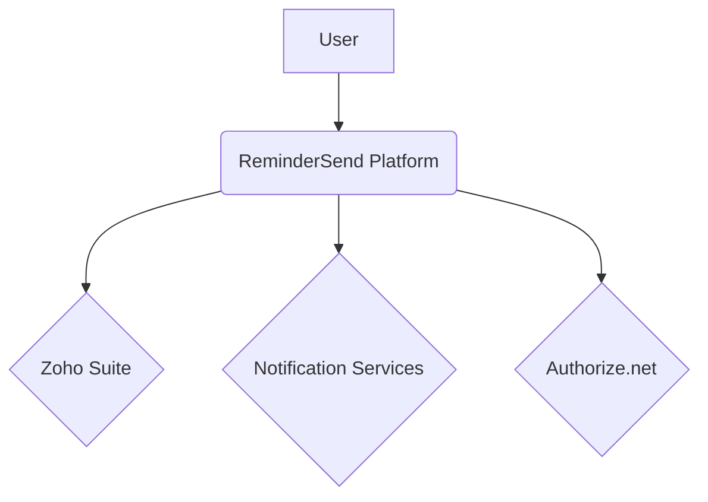
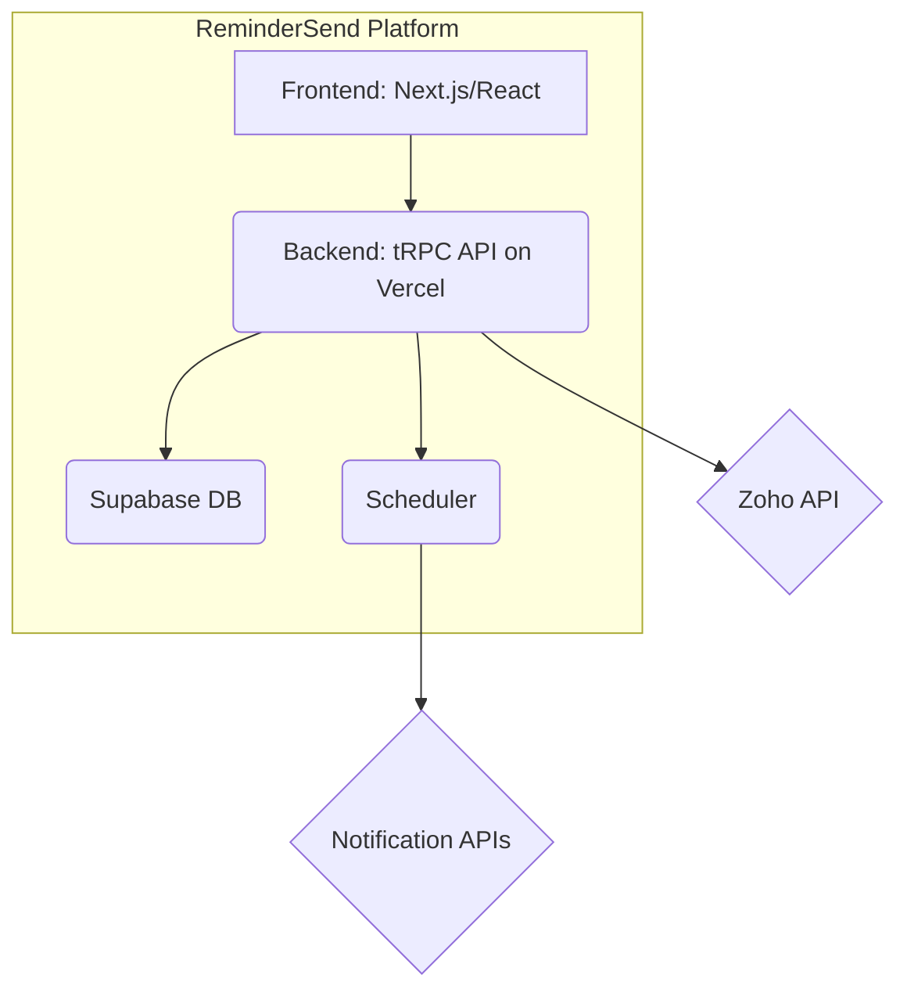
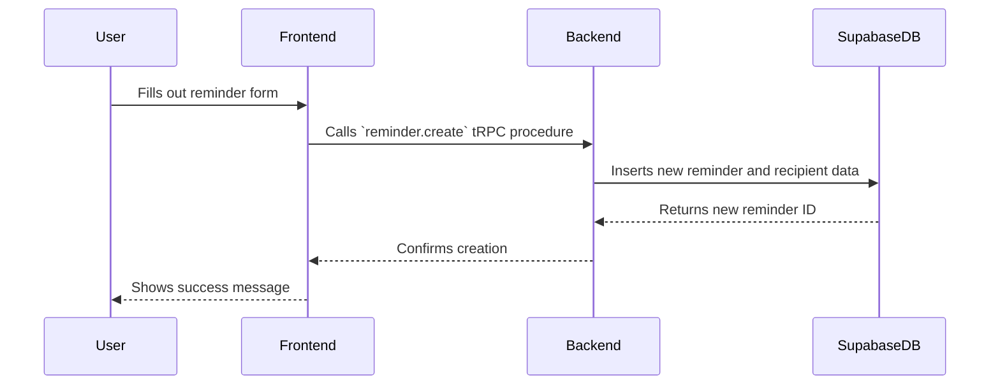
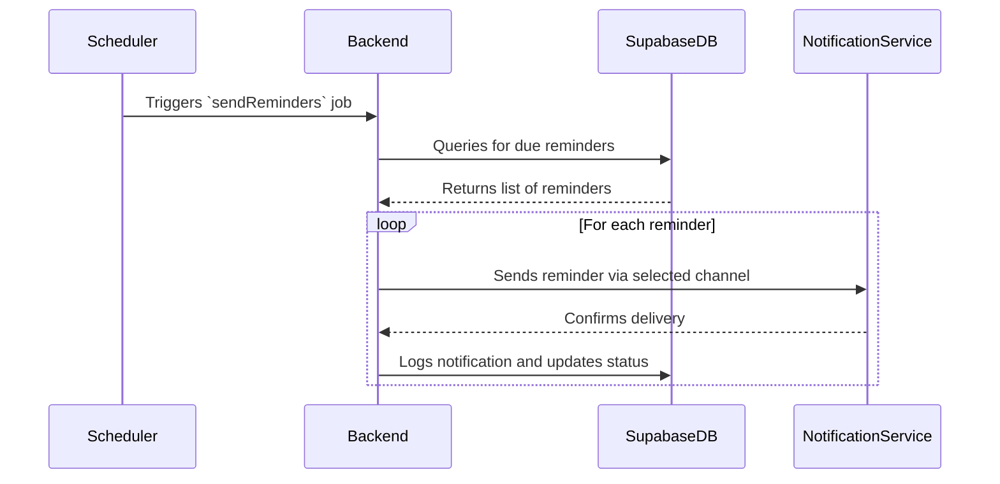
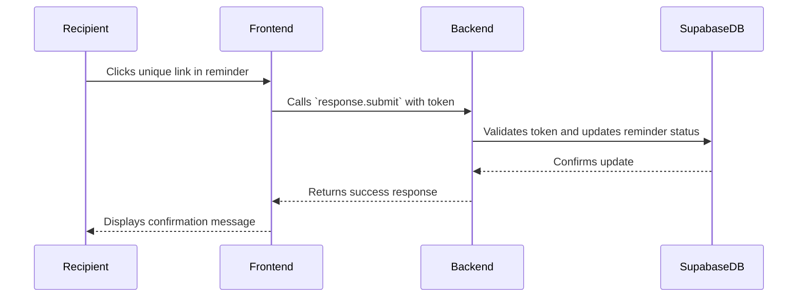

# 03. System Architecture

**Owner:** Manus AI
**Last Updated:** 2025-12-18
**Version:** 1.0

**Purpose:** This document provides a comprehensive overview of the system architecture for ReminderSend. It details the high-level design, data flows, multi-tenancy model, and key technical decisions to guide AI agent development.

---

## 1. High-Level Architecture (C4 Model: Level 1 & 2)

The architecture is designed around a serverless, multi-tenant model hosted on Vercel and Supabase, ensuring scalability, security, and rapid development.

### Level 1: System Context

| System | Description |
| :--- | :--- |
| **ReminderSend Platform** | The core SaaS application providing reminder delegation services. |
| **Zoho Suite** | External system of record for billing, invoicing, CRM, and support. |
| **Notification Services** | External services (SendGrid, WhatsApp, Telegram) for delivering reminders. |
| **Authorize.net** | Payment processor, integrated via Zoho Billing. |

### Level 2: Container Diagram

| Container | Description | Technology |
| :--- | :--- | :--- |
| **Frontend** | The user-facing web application for creators and the response page for recipients. | Next.js 15, React, Refine, Tailwind CSS, Metronic |
| **Backend API** | The serverless backend handling all business logic, authentication, and integrations. | Node.js, TypeScript, tRPC, Zod, Vercel Serverless Functions |
| **Supabase DB** | The multi-tenant PostgreSQL database for data persistence and user authentication. | Supabase, PostgreSQL, Supabase Auth, RLS |
| **Scheduler** | The background job runner for sending scheduled reminders and running sync tasks. | Vercel Cron |

## 2. Data Flow Diagrams

### 2.1. Reminder Creation & Scheduling

### 2.2. Reminder Sending

### 2.3. Recipient Response

## 3. Multi-Tenant Model

The platform uses a robust multi-tenant architecture with data isolation enforced at the database level using Supabase's Row-Level Security (RLS).

*   **Isolation:** Each organization's data is isolated by an `organization_id`. Users belong to an organization, and all data they create is automatically tagged with their `organization_id`.
*   **RLS Policies:** Database policies ensure that users can only access data associated with their own `organization_id`. This is enforced for all `SELECT`, `INSERT`, `UPDATE`, and `DELETE` operations.
*   **Authentication:** Supabase Auth handles user authentication and JWT generation. The JWT contains the user's `organization_id`, which is used by the RLS policies.

## 4. Background Job Strategy

**Vercel Cron** is the chosen solution for scheduling and running background jobs due to its tight integration with the Vercel serverless environment and ease of use.

| Job | Schedule | Description |
| :--- | :--- | :--- |
| **Send Reminders** | Every minute | Queries the database for reminders that are due to be sent and dispatches them. |
| **Sync Zoho Data** | Daily at 2 AM UTC | Synchronizes subscription and invoice data from Zoho Billing and Books. |
| **Database Cleanup** | Weekly | Archives old notifications and performs other database maintenance tasks. |

**Tradeoffs:**
*   **Pros:** Simple to configure, serverless (no infrastructure to manage), and co-located with the backend API.
*   **Cons:** Less flexibility than a dedicated queueing system like RabbitMQ or SQS. If job complexity grows significantly, a migration to a dedicated queue may be necessary.

## 5. Key Design Decisions

| Decision | Rationale |
| :--- | :--- |
| **tRPC over REST/GraphQL** | Provides end-to-end type safety between the frontend and backend, which is ideal for AI-driven development and reduces the likelihood of integration errors. |
| **Supabase for Database & Auth** | Offers a powerful combination of a managed PostgreSQL database, built-in authentication, and real-time capabilities, significantly accelerating development. |
| **Refine for Frontend** | The Refine framework, combined with the Metronic UI kit, provides a production-ready admin panel out of the box, allowing development to focus on core business logic. |
| **Serverless on Vercel** | Automatic scaling, global distribution, and seamless CI/CD integration make Vercel the optimal choice for hosting the Next.js frontend and serverless backend. |

## Implementation Notes for AI Agents

*   **RLS is Critical:** The RLS policies are the cornerstone of the multi-tenant security model. They must be implemented and tested thoroughly before any data is written to the database.
*   **Stateless Backend:** The tRPC backend must be stateless to work correctly in a serverless environment. All state should be stored in the Supabase database.
*   **Idempotent Jobs:** Background jobs should be designed to be idempotent. If a job fails and is retried, it should not produce duplicate data or unintended side effects.
*   **Acceptance Criteria:**
    *   The system architecture diagram accurately reflects the implemented components.
    *   Data flow diagrams are validated against the actual tRPC procedures and database queries.
    *   RLS policies are in place and prevent users from accessing data outside their organization.
    *   Vercel Cron jobs are configured and successfully trigger the specified backend functions.
