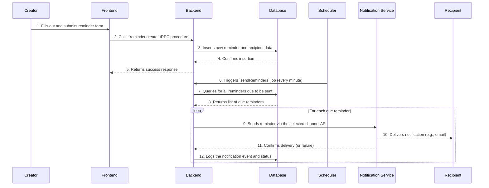

# 03. System Architecture

**Owner:** Manus AI
**Last Updated:** 2025-12-26
**Version:** 2.0

**Purpose:** This document provides a comprehensive overview of the system architecture for ReminderSend. It details the high-level design, data flows, multi-tenancy model, and key technical decisions, translating the product vision into a technical blueprint for AI agent development.

---

## 1. Architectural Vision and Principles

The architecture of ReminderSend is guided by the core product pillars defined in the *00-Product-Vision-and-Business-Context.md*:

*   **Simplicity:** The architecture favors managed, serverless solutions (Vercel, Supabase) to reduce operational complexity and allow the development focus to remain on business logic.
*   **Reliability:** The system is designed for high availability and data integrity, with clear separation of concerns and robust error handling.
*   **Intelligence:** The architecture is built to support future AI-powered features by centralizing business logic in the backend and maintaining a clean data model.
*   **Integration:** A dedicated API client layer and webhook handlers are designed to make integrations with external systems like Zoho clean and maintainable.

## 2. High-Level Architecture (C4 Model)

### Level 1: System Context Diagram

This diagram shows how the ReminderSend platform fits into its operating environment.

```mermaid
graph TD
    subgraph "Internet"
        A[**Creator**<br>(e.g., Freelancer, Manager)] --> B{**ReminderSend Platform**<br>(SaaS Product)}
        B --> C[**Recipient**<br>(e.g., Client, Colleague)]
    end

    subgraph "External Services"
        B --> D{**Zoho Suite**<br>(Billing, Books, CRM, Desk)} 
        B --> E{**Notification Services**<br>(SendGrid, WhatsApp, Telegram)}
        B --> F{**Authorize.net**<br>(via Zoho)}
    end

    style B fill:#1f77b4,stroke:#000,stroke-width:2px,color:#fff
```

| System | Role | Interaction |
| :--- | :--- | :--- |
| **Creator** | The primary user who creates and manages reminders. | Interacts with the ReminderSend web application. |
| **Recipient** | The person who receives the reminder. | Interacts with a simple, no-login web page via a unique link. |
| **Zoho Suite** | The business system of record. | Provides data for billing, invoicing, and CRM; receives escalations for support. |
| **Notification Services** | The delivery channels for reminders. | Sends emails, WhatsApp messages, and Telegram messages on behalf of the platform. |

### Level 2: Container Diagram

This diagram zooms into the ReminderSend platform to show its major building blocks (containers).

```mermaid
graph TD
    subgraph "ReminderSend Platform"
        A[**Frontend**<br>(Next.js on Vercel)] --> B[**Backend API**<br>(tRPC on Vercel Serverless)]
        B --> C[**Database**<br>(Supabase PostgreSQL)]
        D[**Scheduler**<br>(Vercel Cron)] -.-> B
    end

    subgraph "External APIs"
      B --> E{Zoho API}
      B --> F{Notification APIs}
    end

    style A fill:#ff7f0e,stroke:#000,stroke-width:1px,color:#fff
    style B fill:#2ca02c,stroke:#000,stroke-width:1px,color:#fff
    style C fill:#d62728,stroke:#000,stroke-width:1px,color:#fff
    style D fill:#9467bd,stroke:#000,stroke-width:1px,color:#fff
```

| Container | Description | Technology | Rationale |
| :--- | :--- | :--- | :--- |
| **Frontend** | The user-facing web application for Creators and the simple response page for Recipients. | Next.js 15, React, Refine, Tailwind CSS | Provides a modern, fast, and SEO-friendly user experience with a pre-built admin panel structure. |
| **Backend API** | The stateless, serverless backend that handles all business logic, authentication, and integrations. | Node.js, TypeScript, tRPC, Zod | End-to-end type safety with tRPC minimizes integration errors, and the serverless nature ensures scalability. |
| **Database** | The multi-tenant PostgreSQL database for all data persistence and user authentication. | Supabase, PostgreSQL, RLS | A managed, scalable, and secure database with built-in authentication and real-time capabilities. |
| **Scheduler** | The background job runner for sending scheduled reminders and running periodic sync tasks. | Vercel Cron | Tightly integrated with the serverless backend, offering a simple and reliable way to schedule tasks. |

## 3. Data Flow Diagrams

### 3.1. Core Logic: Reminder Creation and Delivery

This diagram shows the end-to-end flow of the platform's primary function.



## 4. Multi-Tenant Architecture

Data isolation is the most critical security feature of the architecture. It is achieved through a combination of database design and Row-Level Security (RLS).

1.  **Organizational Scoping:** Every piece of data in the system (reminders, recipients, etc.) is tied to an `organization_id`.
2.  **JWT Propagation:** When a user authenticates, Supabase Auth generates a JSON Web Token (JWT) that includes their `user_id` and a custom claim for their `organization_id`.
3.  **RLS Enforcement:** This JWT is passed with every API request. The database has RLS policies on every table that inspect the `organization_id` from the JWT and automatically filter all `SELECT`, `INSERT`, `UPDATE`, and `DELETE` queries. This ensures that a user from Organization A can **never** see or modify data belonging to Organization B.

## 5. Internationalization (i18n) Architecture

As per the "Globally Accessible from Day One" design philosophy, the platform MUST be built with internationalization as a core principle. The initial launch will support English and Spanish.

### Frontend i18n

1.  **Framework:** The Next.js frontend will use the `next-intl` library, which is specifically designed for the Next.js App Router.
2.  **String Externalization:** All user-facing strings in the UI (buttons, labels, titles, etc.) MUST be externalized into JSON translation files. No hardcoded strings are permitted in the React components.
    *   Example file structure: `/messages/en.json`, `/messages/es.json`.
3.  **Locale Detection:** The user's preferred language will be detected from the `Accept-Language` browser header and stored in a cookie. Users will also be able to manually switch languages.
4.  **AI-Powered Translation:** A dedicated script will be created to manage the translation process. It will:
    *   Identify missing keys in the `es.json` file compared to the `en.json` (source of truth) file.
    *   Send the English strings to an AI model (e.g., Gemini) to generate the Spanish translations.
    *   Place the AI-generated translations into the `es.json` file, ready for review.

### Backend i18n

*   **Error Messages:** API error messages returned to the frontend should be coded, not string-based (e.g., `error: "EMAIL_IN_USE"`). The frontend will then use this code to look up the appropriate translated error message.
*   **Notification Templates:** Reminder notification templates (for email, WhatsApp, etc.) will also be internationalized. The system will store templates for each supported language and use the recipient's preferred language when sending a notification.

## 6. Scalability and Performance

The architecture is designed to be scalable from the ground up.

*   **Serverless Compute:** The Vercel Serverless Functions that power the backend API can scale automatically to handle thousands of concurrent requests.
*   **Managed Database:** Supabase is a managed PostgreSQL service that can be scaled vertically (by increasing compute resources) as the user base and data volume grow.
*   **Asynchronous Jobs:** By offloading time-consuming tasks like sending notifications to background jobs, the API remains fast and responsive for user-facing interactions.
*   **Efficient Queries:** A thoughtful indexing strategy (detailed in *04-Data-Model-and-RLS.md*) ensures that database queries remain performant even with large datasets.

## Implementation Notes for AI Agents

*   **Stateless Backend Functions:** All tRPC procedures and cron jobs must be stateless. Any required state must be fetched from the database at the beginning of the execution and persisted at the end. Do not rely on in-memory variables between invocations.
*   **Idempotent Cron Jobs:** The `sendReminders` cron job must be idempotent. If it runs twice for the same minute due to a system hiccup, it should not send duplicate reminders. This can be achieved by marking reminders as "in-progress" before sending and filtering them out of subsequent queries.
*   **Centralized API Client:** All interactions with external services (Zoho, SendGrid) must go through a centralized, well-tested API client that handles authentication, retries, and error logging.
*   **Acceptance Criteria:**
    *   The implemented system components and their interactions must match the diagrams in this document.
    *   Automated tests must be in place to verify that the RLS policies correctly isolate data between two different test organizations.
    *   The Vercel Cron jobs must be configured and proven to trigger the correct backend functions at the specified intervals.
    *   The system must gracefully handle API failures from external services (e.g., Zoho being down) without crashing the backend.
