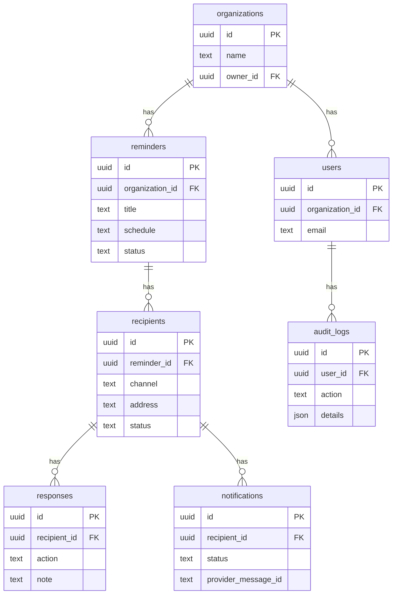

# 04. Data Model and Row-Level Security (RLS)

**Owner:** Manus AI
**Last Updated:** 2025-12-18
**Version:** 1.0

**Purpose:** This document defines the complete database schema for the ReminderSend platform, including table structures, relationships, indexing strategy, and the Row-Level Security (RLS) policies that enforce multi-tenant data isolation.

---

## 1. Database Schema Proposal

The schema is designed for a multi-tenant architecture using PostgreSQL in Supabase. All tables are owned by an organization to ensure strict data partitioning.

### ERD (Entity-Relationship Diagram)



### Table Definitions

**`organizations`**

| Column | Type | Constraints | Description |
| :--- | :--- | :--- | :--- |
| `id` | `uuid` | **Primary Key** | Unique identifier for the organization. |
| `name` | `text` | `NOT NULL` | Name of the organization. |
| `owner_id` | `uuid` | `FOREIGN KEY (auth.users)` | The user who owns the organization. |
| `created_at` | `timestamptz` | `DEFAULT now()` | Timestamp of creation. |

**`users`**

| Column | Type | Constraints | Description |
| :--- | :--- | :--- | :--- |
| `id` | `uuid` | **Primary Key**, `REFERENCES auth.users` | Corresponds to the `id` in `auth.users`. |
| `organization_id` | `uuid` | `FOREIGN KEY (organizations)`, `NOT NULL` | The organization the user belongs to. |

**`reminders`**

| Column | Type | Constraints | Description |
| :--- | :--- | :--- | :--- |
| `id` | `uuid` | **Primary Key** | Unique identifier for the reminder. |
| `organization_id` | `uuid` | `FOREIGN KEY (organizations)`, `NOT NULL` | The organization that owns this reminder. |
| `title` | `text` | `NOT NULL` | The title of the reminder. |
| `description` | `text` | | A more detailed description. |
| `schedule` | `text` | `NOT NULL` | ISO 8601 or cron expression for the schedule. |
| `status` | `text` | `DEFAULT 'active'` | e.g., 'active', 'paused', 'completed'. |
| `created_at` | `timestamptz` | `DEFAULT now()` | Timestamp of creation. |

... and so on for `recipients`, `responses`, `notifications`, `audit_logs`, `templates`, `channel_identities`, and `consent_records`.

## 2. Indexing Strategy

Indexes are critical for query performance, especially in a multi-tenant environment.

*   **Foreign Keys:** All foreign key columns (`organization_id`, `reminder_id`, etc.) will be indexed to speed up joins.
*   **Status Columns:** Columns that are frequently used in `WHERE` clauses, such as `reminders.status` and `recipients.status`, will be indexed.
*   **Timestamps:** `created_at` columns will be indexed to support time-based queries and sorting.

## 3. Row-Level Security (RLS) Policies

RLS is the core of the multi-tenant security model. The following policies will be applied to all data tables.

**Example RLS Policy for `reminders` table:**

```sql
-- Enable RLS on the table
ALTER TABLE reminders ENABLE ROW LEVEL SECURITY;

-- Policy: Users can only access reminders belonging to their organization
CREATE POLICY "Allow access to own organization's reminders" ON reminders
AS PERMISSIVE FOR ALL
TO authenticated
USING (organization_id = (SELECT organization_id FROM users WHERE id = auth.uid()))
WITH CHECK (organization_id = (SELECT organization_id FROM users WHERE id = auth.uid()));
```

This policy ensures that a user's JWT is used to identify their `organization_id`, and all queries are automatically filtered to that organization.

## 4. Encryption Strategy

*   **At Rest:** All data is encrypted at rest by default on Supabase servers (AES-256).
*   **In Transit:** All communication with the database is encrypted using TLS 1.3.
*   **Sensitive Columns:** While no PII is planned for storage directly, if any sensitive data (like API tokens for integrations) is stored, it will be encrypted at the application level before being written to the database, using a library like `libsodium`.

## 5. GDPR Deletion and Portability

*   **Deletion:** When a user requests deletion, a cascading delete will be triggered from the `organizations` table, removing all associated data.
*   **Portability:** A script will be created to export all data related to a specific user or organization into a JSON format, fulfilling the right to data portability.

## Implementation Notes for AI Agents

*   **Migrations First:** All schema changes MUST be implemented as Supabase migration files. Do not make changes directly in the Supabase UI.
*   **RLS on Every Table:** Every table containing organization-specific data MUST have an RLS policy applied.
*   **Test RLS:** Write specific tests to verify that RLS policies are working correctly and that users cannot access data from other organizations.
*   **Acceptance Criteria:**
    *   The database schema is implemented as defined in this document via Supabase migrations.
    *   RLS policies are in place for all relevant tables.
    *   Tests confirm that data is isolated between different organizations.
    *   An indexing strategy is implemented to ensure efficient query performance.
