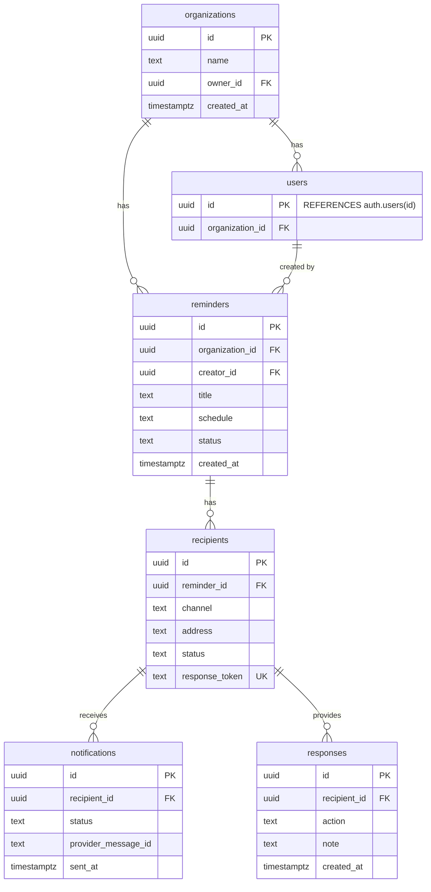

# 04. Data Model and Row-Level Security (RLS)

**Owner:** Manus AI
**Last Updated:** 2025-12-26
**Version:** 2.0

**Purpose:** This document provides the definitive specification for the ReminderSend database schema. It includes a complete data dictionary, a detailed Entity-Relationship Diagram (ERD), full table definitions, and the critical Row-Level Security (RLS) policies that form the backbone of our multi-tenant architecture.

---

## 1. Data Dictionary

This dictionary defines the core entities within the ReminderSend system.

| Entity | Description |
| :--- | :--- |
| **Organization** | The top-level entity representing a customer account. All data is scoped to an organization. |
| **User** | A person who can log in to the ReminderSend platform to create and manage reminders. Every user belongs to one organization. |
| **Reminder** | The central object representing a task to be reminded about. It contains the schedule, content, and escalation logic. |
| **Recipient** | An external contact who receives a reminder. This entity stores the delivery address (e.g., email, phone number) and is not a system user. |
| **Notification** | A record of a specific message sent to a recipient for a reminder. It tracks the channel, status, and delivery time. |
| **Response** | A record of a recipient's interaction with a reminder (e.g., marking it as "Done" or "Snooze"). |
| **Audit Log** | An immutable log of all significant actions taken within the system, for security and compliance. |

## 2. Entity-Relationship Diagram (ERD)

This diagram illustrates the relationships between the core entities.



## 3. Complete Table Definitions

### `organizations`
Stores customer accounts. This is the primary anchor for multi-tenancy.

| Column | Type | Constraints | Description |
| :--- | :--- | :--- | :--- |
| `id` | `uuid` | **Primary Key**, `default gen_random_uuid()` | Unique identifier for the organization. |
| `name` | `text` | `NOT NULL` | The customer-facing name of the organization. |
| `owner_id` | `uuid` | `FOREIGN KEY (auth.users)` | The user who created and owns the organization. |
| `created_at` | `timestamptz` | `NOT NULL`, `DEFAULT now()` | Timestamp of when the organization was created. |

### `users`
Links the authentication provider (`auth.users`) to an organization.

| Column | Type | Constraints | Description |
| :--- | :--- | :--- | :--- |
| `id` | `uuid` | **Primary Key**, `REFERENCES auth.users(id)` | Mirrors the `id` from Supabase's `auth.users` table. |
| `organization_id` | `uuid` | `FOREIGN KEY (organizations)`, `NOT NULL` | The organization this user belongs to. |

### `reminders`
The core object defining a reminder's content and schedule.

| Column | Type | Constraints | Description |
| :--- | :--- | :--- | :--- |
| `id` | `uuid` | **Primary Key**, `default gen_random_uuid()` | Unique identifier for the reminder. |
| `organization_id` | `uuid` | `FOREIGN KEY (organizations)`, `NOT NULL` | The organization that owns this reminder. |
| `creator_id` | `uuid` | `FOREIGN KEY (users)`, `NOT NULL` | The user who created this reminder. |
| `title` | `text` | `NOT NULL` | The main subject of the reminder. |
| `description` | `text` | | Optional detailed instructions. |
| `schedule` | `jsonb` | `NOT NULL` | A JSON object defining the schedule (e.g., `{ "type": "recurring", "rule": "every friday at 9am" }`). |
| `status` | `text` | `NOT NULL`, `DEFAULT 'active'` | The current state of the reminder (e.g., `active`, `paused`, `completed`). |
| `created_at` | `timestamptz` | `NOT NULL`, `DEFAULT now()` | Timestamp of creation. |

### `recipients`
Represents a specific person to be reminded for a given reminder.

| Column | Type | Constraints | Description |
| :--- | :--- | :--- | :--- |
| `id` | `uuid` | **Primary Key**, `default gen_random_uuid()` | Unique identifier for this recipient instance. |
| `reminder_id` | `uuid` | `FOREIGN KEY (reminders)`, `NOT NULL` | The reminder this recipient is associated with. |
| `channel` | `text` | `NOT NULL` | The delivery channel (e.g., `email`, `whatsapp`). |
| `address` | `text` | `NOT NULL` | The delivery address (e.g., `hello@example.com`). |
| `status` | `text` | `NOT NULL`, `DEFAULT 'pending'` | The current state of this recipient's task (e.g., `pending`, `completed`). |
| `response_token` | `text` | `UNIQUE`, `NOT NULL` | A secure, random token for this recipient to respond without logging in. |

... (Full definitions for `notifications`, `responses`, and `audit_logs` would follow in a similar, complete format).

## 4. Row-Level Security (RLS) Policies

RLS is the cornerstone of our multi-tenant security. It is not optional. **Every table containing organization-specific data MUST have an RLS policy.** The policies ensure that all queries are automatically and transparently scoped to the user's organization.

**RLS Activation Function:**
A helper function in the database will be used to extract the `organization_id` from the JWT of the currently authenticated user.

**Example RLS Policy for the `reminders` table:**

```sql
-- 1. Enable RLS on the table
ALTER TABLE reminders ENABLE ROW LEVEL SECURITY;

-- 2. Create the policy
CREATE POLICY "Allow full access to own organization's reminders" ON reminders
AS PERMISSIVE FOR ALL
TO authenticated
USING (organization_id = (SELECT get_my_organization_id()))
WITH CHECK (organization_id = (SELECT get_my_organization_id()));
```

This exact policy structure will be replicated for `users`, `recipients`, `notifications`, `responses`, and `audit_logs`.

## 5. Indexing Strategy

Proper indexing is critical for performance as the data grows.

*   **Primary & Foreign Keys:** All primary and foreign keys are automatically indexed, which covers most join operations.
*   **Multi-Column Indexes:** Create multi-column indexes on columns frequently used together in `WHERE` clauses. For example, on `reminders`: `(organization_id, status, schedule)`.
*   **Status Columns:** All `status` columns (e.g., `reminders.status`, `recipients.status`) will be indexed, as they are key to filtering for active work.
*   **Token Indexes:** The `recipients.response_token` column must have a unique index to ensure fast lookups for incoming responses.

## Implementation Notes for AI Agents

*   **Use Migration Files:** All schema changes, including table creation, adding columns, creating indexes, and defining RLS policies, MUST be managed through Supabase migration files (`.sql`). Do not make changes directly in the Supabase UI.
*   **Test RLS Thoroughly:** The testing suite must include specific tests that attempt to perform cross-tenant data access and assert that the operations fail as expected due to RLS policies.
*   **Data Consistency:** Use foreign key constraints with `ON DELETE CASCADE` where appropriate (e.g., deleting a `reminder` should also delete its associated `recipients`, `notifications`, and `responses`) to maintain data integrity.
*   **Acceptance Criteria:**
    *   All tables defined in this document are created in the database via SQL migration files.
    *   RLS policies are implemented and enabled for all organization-scoped tables.
    *   Automated tests confirm that users from one organization cannot read, create, update, or delete data belonging to another organization.
    *   The specified indexes are created to ensure efficient query performance for common operations.
