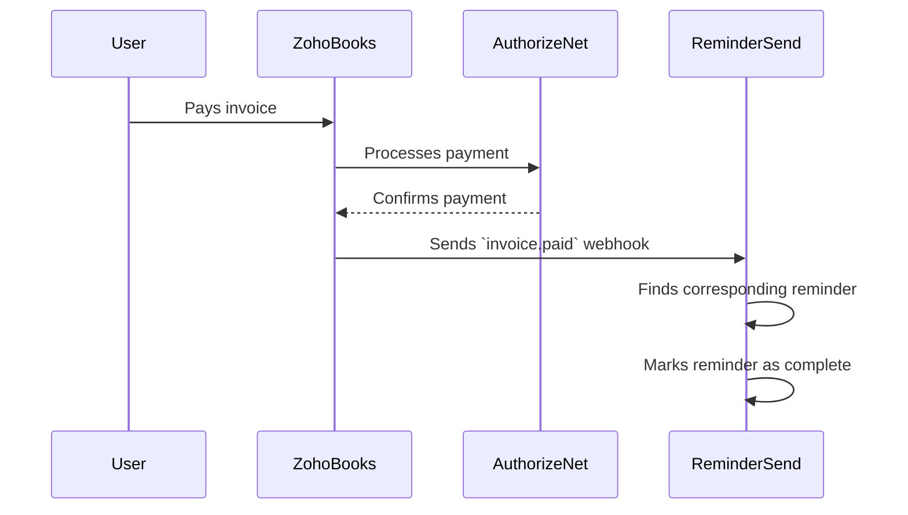

# 07. Integrations: Zoho and Authorize.Net

**Owner:** Manus AI
**Last Updated:** 2025-12-18
**Version:** 1.0

**Purpose:** This document specifies the architecture and data flows for all third-party integrations, focusing on the Zoho suite (Billing, Books, CRM, Desk) and Authorize.Net. It provides the technical details required for AI agents to implement these integrations.

---

## 1. Zoho Integration Strategy

Zoho serves as the backend system of record for all commercial and customer support activities. ReminderSend provides the user-facing experience and orchestrates workflows, while Zoho handles the core business processing. All integrations will be built using the Zoho API, with OAuth 2.0 for authentication.

### 1.1. Zoho Billing

*   **Subscription Lifecycle:** ReminderSend will use Zoho Billing to manage the entire subscription lifecycle, including plan selection, upgrades, downgrades, and cancellations.
*   **Sync Strategy:** A one-way synchronization from Zoho Billing to ReminderSend will occur daily. A Vercel Cron job will fetch all active subscriptions and update the local database.
*   **Conflict Handling:** Zoho Billing is the single source of truth. If there is a discrepancy between the local data and Zoho, the Zoho data will always take precedence.

### 1.2. Zoho Books

*   **Invoicing and Payment Detection:** Users can link reminders to specific invoices in Zoho Books. The system will then monitor the payment status of that invoice.
*   **Auto-Completion:** When an invoice is marked as "paid" in Zoho Books (either manually or via an integrated payment gateway), a webhook will be sent to ReminderSend, which will automatically mark the corresponding reminder as complete.

### 1.3. Zoho CRM

*   **Contact Sync:** Users can import contacts from Zoho CRM to create recipient lists in ReminderSend, reducing manual data entry.
*   **Tagging Strategy:** When a reminder is sent or completed, a tag will be added to the corresponding contact in Zoho CRM (e.g., `reminder-sent`, `reminder-completed`). This allows for customer segmentation and targeted follow-up.

### 1.4. Zoho Desk

*   **Escalation Policy:** If a reminder remains unanswered for a configurable period (e.g., 10 days), the system will automatically create a ticket in Zoho Desk.
*   **Ticket Structure:** The ticket will contain the reminder details, recipient information, and a history of all communication. No sensitive PII will be included.
*   **Auto-Close Behavior:** When the Zoho Desk ticket is closed, it can trigger a webhook to update the status of the reminder in ReminderSend.

## 2. Authorize.Net Integration

*   **Usage via Zoho:** For the MVP, all payment processing will be handled through Zoho Billing's integration with Authorize.Net. ReminderSend will not have a direct integration with Authorize.Net.
*   **Tokenization:** ReminderSend will never store raw credit card information. All payment details are managed by Zoho and tokenized by Authorize.Net.
*   **Direct Integration (Future):** A direct integration with Authorize.Net may be considered post-MVP to enable more customized payment flows, but this is not in the initial scope.

## 3. Data Mapping and Sequence Diagrams

### 3.1. Data Mapping

| ReminderSend Object | Zoho Object | Fields Mapped |
| :--- | :--- | :--- |
| `Organization` | `Zoho Billing Customer` | `name`, `email` |
| `Subscription` | `Zoho Billing Subscription` | `plan_id`, `status`, `next_billing_at` |
| `Invoice Reminder` | `Zoho Books Invoice` | `invoice_number`, `due_date`, `total`, `balance` |
| `Recipient` | `Zoho CRM Contact` | `first_name`, `last_name`, `email`, `phone` |

### 3.2. Sequence Diagram: Invoice Payment and Reminder Completion

## Implementation Notes for AI Agents

*   **Build a Zoho API Client:** Create a dedicated, reusable client for interacting with the Zoho API. This client should handle authentication (OAuth 2.0 token refresh), rate limiting, and error handling.
*   **Secure Webhook Endpoints:** All webhook endpoints must be secured by validating the Zoho signature. Store the webhook secrets securely.
*   **Idempotent Webhook Handlers:** Design all webhook handlers to be idempotent to prevent duplicate processing of events.
*   **Acceptance Criteria:**
    *   A user can connect their Zoho account to ReminderSend using OAuth.
    *   Subscription data from Zoho Billing is successfully synced to the ReminderSend database.
    *   Linking a reminder to a Zoho Books invoice works correctly.
    *   A paid invoice in Zoho Books automatically completes the corresponding reminder in ReminderSend.
    *   An unanswered reminder correctly triggers the creation of a ticket in Zoho Desk.
