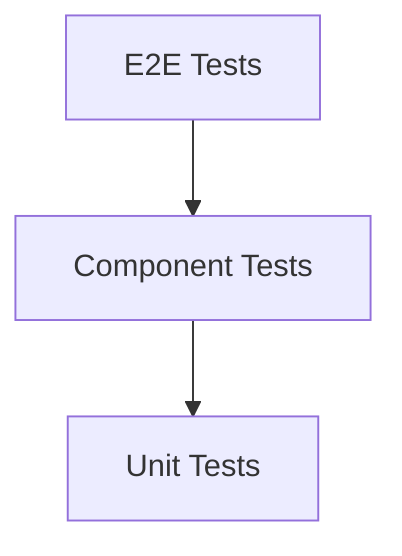

_# 09. Testing, QA, and Performance

**Owner:** Manus AI
**Last Updated:** 2025-12-18
**Version:** 1.0

**Purpose:** This document defines the comprehensive testing, quality assurance (QA), and performance strategy for the ReminderSend platform. It establishes the standards and processes that AI agents must follow to ensure a high-quality, reliable, and performant application.

---

## 1. Test Pyramid

Our testing strategy is based on the classic test pyramid model, emphasizing a large base of fast, inexpensive unit tests and progressively fewer, more comprehensive tests at the higher levels.

| Test Level | Framework/Tool | Coverage Target | Description |
| :--- | :--- | :--- | :--- |
| **Unit Tests** | Jest | > 80% | Tests individual functions and tRPC procedures in isolation. Focuses on business logic, validation, and edge cases. |
| **Component Tests** | React Testing Library | > 70% | Tests individual React components, verifying rendering, state changes, and user interactions. |
| **End-to-End (E2E) Tests** | Playwright | > 90% of critical user flows | Tests complete user journeys through the live application, from the UI to the database. Simulates real user behavior. |

## 2. What Must Be Tested

*   **Critical User Flows:**
    *   User signup and login.
    *   Creating, viewing, and updating a reminder.
    *   The entire notification sending and response-handling lifecycle.
    *   Connecting to Zoho and syncing data.
*   **Business Logic:** All tRPC procedures must have corresponding unit tests.
*   **UI Components:** All interactive components (forms, buttons, dashboards) must have component tests.
*   **Security:**
    *   RLS policies must be tested to ensure data isolation.
    *   Webhook signature validation must be tested.
    *   Input validation (Zod schemas) must be tested against malicious inputs.

## 3. Load Testing Plan

Load testing will be conducted before the public launch to ensure the platform can handle the expected user load.

*   **Tool:** k6 (or similar open-source tool).
*   **Scenarios:**
    *   **Notification Sending Bursts:** Simulate a large number of reminders being sent simultaneously (e.g., at the top of the hour).
    *   **Cron Spikes:** Simulate the load on the database and backend when the Vercel Cron jobs run.
    *   **Concurrent Users:** Simulate a realistic number of users browsing the dashboard and creating reminders.
*   **Target:** The system should maintain a p95 API response time of < 200ms under a load of 100 concurrent users.

## 4. Performance Budgets

Performance is a feature. The following budgets are enforced in the CI/CD pipeline.

| Metric | Budget | Tool |
| :--- | :--- | :--- |
| **API Response Time (p95)** | < 200ms | Datadog APM |
| **UI Load Time (LCP)** | < 2 seconds | Vercel Analytics, Lighthouse |
| **Frontend Bundle Size** | < 250 KB (initial load) | Next.js Build Analyzer |

## 5. Accessibility Checks

The platform must be accessible to all users, including those with disabilities.

*   **Standard:** WCAG 2.1 AA.
*   **Automated Checks:** The CI/CD pipeline will include an automated accessibility checker (e.g., `axe-core`) to catch common issues.
*   **Manual Checks:** Manual testing will be performed for:
    *   Keyboard-only navigation.
    *   Screen reader compatibility (e.g., VoiceOver, NVDA).
    *   Color contrast.

## 6. Security Testing Checklist

| Test | Method | Tool/Process |
| :--- | :--- | :--- |
| **Cross-Tenant Access** | E2E Test | Create two users in different organizations and write a Playwright test to verify that one user cannot access the other's data. |
| **Webhook Signature Validation** | Unit Test | Write a unit test that sends a mock webhook with an invalid signature and asserts that it is rejected. |
| **Input Injection** | Unit Test | Test Zod schemas with common injection payloads (e.g., `' OR 1=1; --`). |
| **Dependency Vulnerabilities** | Automated Scan | Use `npm audit` or a similar tool in the CI/CD pipeline to scan for known vulnerabilities. |

## Implementation Notes for AI Agents

*   **Test-Driven Development (TDD) is Encouraged:** For complex business logic, write the unit tests first to define the expected behavior, then implement the code to make the tests pass.
*   **Mock External Services:** In unit and component tests, always mock external services (Zoho, notification providers, etc.) to ensure tests are fast and reliable.
*   **Generate Test Data:** Create utility functions to generate realistic test data (users, reminders, etc.) for your tests.
*   **Acceptance Criteria:**
    *   The CI/CD pipeline is configured to run all levels of the test pyramid on every commit.
    *   The overall test coverage meets the defined targets (>80% for unit tests).
    *   All critical user flows are covered by E2E tests.
    *   Performance budgets are enforced, and the build will fail if a budget is exceeded.
    *   Automated accessibility checks are integrated into the pipeline.
